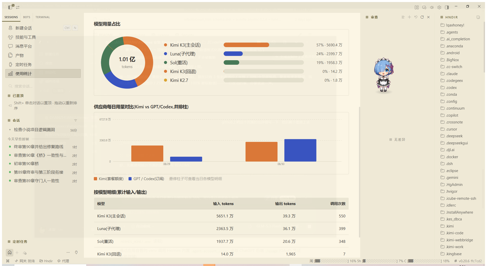

<p align="center">
  
</p>

# Hermes Agent · 个人定制版(桌面端状态栏额度进度条)

这是 [NousResearch/hermes-agent](https://github.com/NousResearch/hermes-agent)(MIT 协议)的个人 Fork,在官方版本上增加了**桌面端状态栏原生额度进度条**等界面定制。所有改动均为本地源码定制,不改变上游任何行为;官方原版说明见 [UPSTREAM_README.md](UPSTREAM_README.md)。

## 这个 Fork 干了什么

### 1. 状态栏原生额度进度条(核心功能)

桌面版状态栏新增一个额度项,实时显示两大供应商的剩余额度,**无需打开任何网页、控制台或第三方工具**:

<p align="center">
  
</p>

- **周 / 5h** —— Kimi Coding Plan 的周额度与 5 小时滚动窗口(已用百分比 + 进度条)
- **C** —— Codex 订阅会话窗口(子代理 Luna/Terra/Sol 共享池)
- 每 60 秒自动刷新,主进程侧缓存 5 分钟;数据不可用时该项自动隐藏,不占地方
- 鼠标悬停有完整说明;与内置上下文用量表并排工作,互不干扰

**实现方式**(全部在应用自身进程体系内,零外部依赖、无常驻服务):

| 数据源 | 获取路径 |
|---|---|
| Kimi | 主进程直连 `api.kimi.com/coding/v1/usages`(Kimi Code 官方用量端点,`sk-kimi-` Key 从 `HERMES_HOME/.env` 读取) |
| Codex | 通过应用自管的 venv 调用 Hermes 内置 `agent.account_usage`,读取 ChatGPT 后端 `/usage`(OAuth 凭证本地存储) |

渲染进程与主进程之间通过新增的 IPC 通道 `hermes:quota:providers` 通信。

### 2. 上下文用量表防闪烁

官方版在回合生成中、切换会话、恢复旧会话时,后端不上报上下文明细,状态栏会闪回裸 token 数。本 Fork 按会话缓存最后一次明细,空档期沿用旧值,**显示稳定不闪烁**(切换会话时正确重置,不会串数据)。

### 3. 使用统计页(原生侧栏页面)

<p align="center">
  
</p>

侧栏"定时任务"下方新增**使用统计**入口(经官方 registry 贡献机制挂载,workspace 全页面),点开即见:

- **统计卡片**:累计 Token 数、峰值单日、API 调用总数、活跃天数、当前连续天数、会话总数
- **Token 活动格子图**:近 11 周 GitHub 贡献墙样式,颜色越深用量越大
- **每日 Token 趋势折线**:近 7/30 天可切换,按模型分线(Kimi K3 / Luna / Sol 各一色)
- **模型用量占比环图** + 分模型百分比条
- **供应商每日用量并排柱状图**:Kimi(套餐额度)vs GPT/Codex(订阅)分组对比,悬停查看当日各模型明细
- **按模型明细表**:累计输入 / 输出 / 调用次数

**数据来源**:主进程 IPC 解析本地 `agent.log` 中每次 API 调用的 token 记录(in/out),按日/按模型聚合,60 秒缓存;页面支持近 7 天 / 近 30 天切换与手动刷新。与供应商后台的"百分比额度"互补——这里看的是**绝对用量**,状态栏看的是**剩余额度**。

**实现**:新增 `app/usage-stats/`(页面 + registry 贡献注册)、`hermes:usage:stats` IPC(main.ts 解析日志)、preload 桥接与类型声明。经官方 `routes` + `sidebar.nav` 贡献区挂载,**不改动上游路由/视图类型,更新零冲突**。

## 改动清单

| 文件 | 改动 |
|---|---|
| `apps/desktop/electron/main.ts` | 新增 `hermes:quota:providers` IPC:Kimi 用量直连 + Codex 经 venv 子进程,5 分钟缓存 |
| `apps/desktop/electron/preload.ts` | 暴露 `getProviderQuota()` 桥接方法 |
| `apps/desktop/src/global.d.ts` | 桥接方法类型声明 |
| `apps/desktop/src/app/shell/hooks/use-statusbar-items.tsx` | 新增额度状态栏项(进度条渲染)+ 上下文明细防闪烁缓存 |

## 安装 / 使用

与官方版完全一致(见 [UPSTREAM_README.md](UPSTREAM_README.md))。本 Fork 的额度条使用前提:

- Kimi 额度条:Kimi Coding Plan 订阅,并在 `HERMES_HOME/.env` 中配置 `KIMI_API_KEY`
- Codex 额度条:已登录的 Codex 订阅(ChatGPT Plus 及以上)

## 更新与同步

定制提交直接位于 main 分支,应用内更新(重置到本 Fork 的 main)不会丢失定制:

```bash
# 跟进官方新版本:同步上游后正常使用应用内更新即可
git fetch upstream && git merge upstream/main
# 或在 GitHub 页面点 Sync fork
```

## 安全说明

- 供应商密钥、会话数据、记忆全部存放在 `HERMES_HOME`(git 忽略,不入库)
- 仓库全历史经过密钥扫描,不含任何真实凭据

## License

MIT(与上游一致),版权归 Nous Research 及所有上游贡献者;本 Fork 的改动同样以 MIT 发布。
